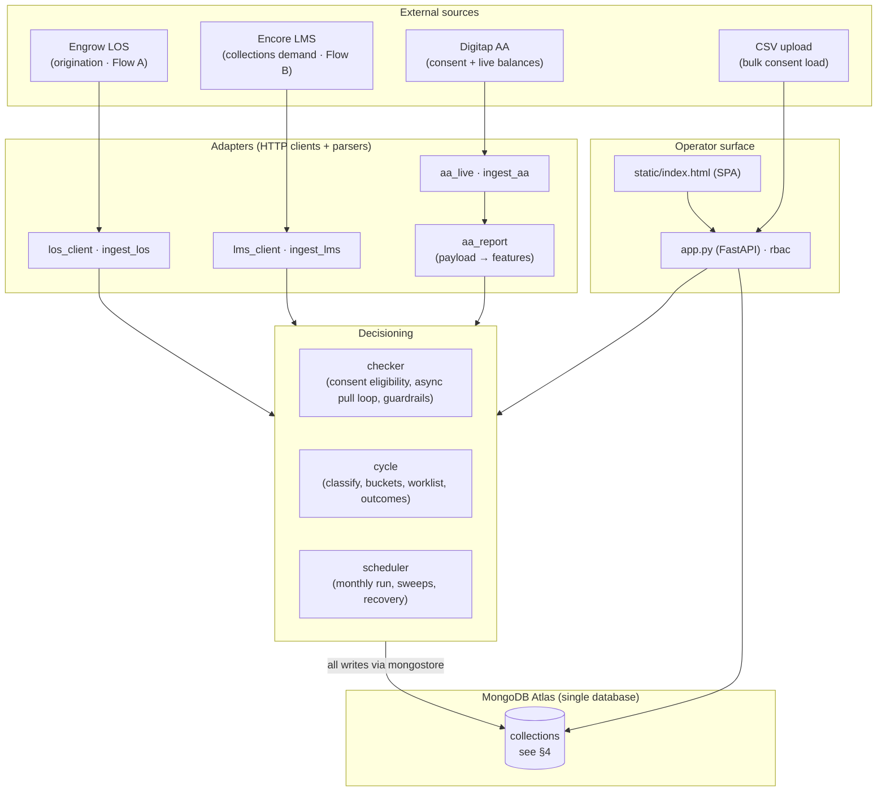
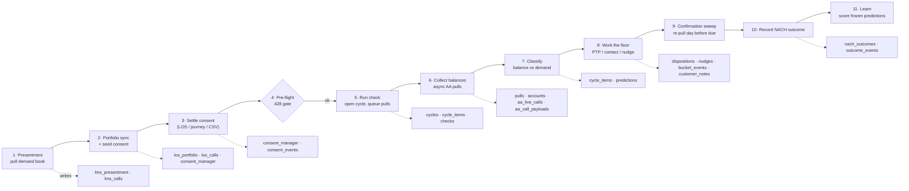
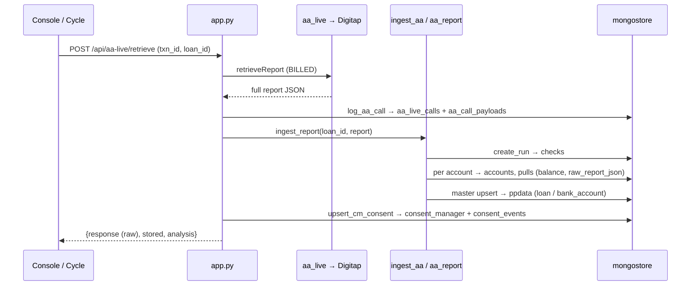

# Sherlock — Architecture & Data Model

> How the system is put together, how data flows in, and what every MongoDB
> collection holds. Written for contributors — if you're new, read
> [`prompt.md`](prompt.md) first for the *why*, then this for the *how*.

Sherlock reads a borrower's **live bank balance** through the Account Aggregator
(AA) network **before** a NACH auto‑debit is presented, and sorts the month's
due book into *act‑now* vs *leave‑alone*. It integrates three vendors, decides
in one engine, persists to one store, and is operated through one console.

---

## 1. System layers



**One rule about the store:** every write goes through `mongostore.py`. No other
module talks to the database directly. That's where the id sequences, the
IST timestamps, the join keys, and the append‑only audit writes live.

---

## 2. The monthly flow (how data moves)

A collections officer (CRO) runs one loop per month. Each stage is gated on the
one before it and writes specific collections:



**Classification** measures the balance at presentation against the **demand**,
producing one of four buckets:

| Bucket | Meaning | Action |
|---|---|---|
| `COMFORT` | clears comfortably | leave alone |
| `WATCH` | clears, thinly | nudge |
| `SHORTFALL` | will bounce as it stands | the floor works this list |
| `NO_DATA` | no usable read (no consent / expired / pull failed) | counted as **blind exposure**, never as safe |

---

## 3. The AA pull sequence (data into the DB)

Every AA read runs the same Digitap lifecycle. A first‑time consent runs all
five calls; a repeat pull on an existing mandate runs the last three. See
[`prompt.md`](prompt.md) for the billed/free split.



The **full raw payload is persisted twice** on purpose: once in
`aa_live_calls.response` (nested BSON, the call archive) and once in
`aa_call_payloads.response` (the dedicated payload table). Derived balances and
features land in `accounts` / `pulls`; the on‑the‑fly `analyse()` read is
returned to the UI but **not** stored.

---

## 4. The data model — every collection

All collections live in one MongoDB database (`MONGO_DB`, default set in
`.env`). Ids are integer sequences from the `counters` collection. Every
timestamp is written and compared in **IST** (see §5).

### Master data
| Collection | Holds | Written by |
|---|---|---|
| `ppdata` | Type‑discriminated master (`type` = `loan` \| `bank_account` \| `consent`): borrower name, EMI, branch, repayment account, AA‑enabled flag | `mongostore._upsert_master`, ingest paths |
| `borrowers` | The book of every disbursed borrower (contact, demand context) | presentment / borrowers sync |
| `counters` | Atomic id sequences (`checks`, `pulls`, `aa_live_calls`, …) — infrastructure, not business data | `mongostore._seq` |

### Integration ledgers & snapshots
| Collection | Holds | Written by |
|---|---|---|
| `lms_presentment` | Encore LMS presentment snapshot — loans due this month (contact, demand amount, due date, OD days) | `ingest_lms` |
| `lms_calls` | Every Encore API call (request/response, mode, result) | `lms_client` via `mongostore` |
| `los_portfolio` | Engrow LOS portfolio snapshot — repayment account + EMI per loan | `ingest_los` |
| `los_calls` | Every Engrow API call | `los_client` |
| `aa_live_calls` | **Digitap call ledger** — one row per call: kind, mode, ok, http, request_id/txn, `request`, `response` (full raw payload), redacted `curl`, `url` | `mongostore.log_aa_call` |
| `aa_call_payloads` | **Dedicated payload archive** — the entire request + response of every Digitap call, back‑linked by `call_id` | `mongostore.log_aa_call` |

### AA evidence (per run)
| Collection | Holds | Written by |
|---|---|---|
| `checks` | The run/check that ties a pull together (loan, EMI, account_count, status, `triggered_by`, cycle linkage) | `mongostore.create_run` / `finalize_run` |
| `accounts` | Resolved bank account per run (bank, masked ref, holder name, IFSC, `fetch_type`, `is_repayment`, balance‑as‑of) | `mongostore.add_account` |
| `pulls` | One row per account per run: `status` (INITIATED→PROCESSING→RETRIEVED/FAILED/CAPPED), `available_balance`, `fetch_type` (PERIODIC/ONETIME), `main_txn_id`, `child_txn_id`, `raw_report_json`, cycle/run linkage | `mongostore.add_pull` / `update_pull` |
| `aa_attempts` | The **4‑initiates‑per‑account‑per‑month** guardrail ledger (allowed/blocked + reason) | `mongostore.record_attempt` |
| `consents` | Legacy per‑account consent requests | ingest paths |

### Consent registry (gates billed pulls)
| Collection | Holds | Written by |
|---|---|---|
| `consent_manager` | One row per (loan, consent): `consent_type` (PERIODIC/ONETIME), `status`, `main_txn_id`, `request_id`, validity dates, `expiry`, `source` — **this is what makes a loan pullable** | `mongostore.upsert_cm_consent` |
| `consent_events` | Append‑only history of every consent change (old→new diff, who, when, reason) | `mongostore._log_consent_event` |

### Cycle
| Collection | Holds | Written by |
|---|---|---|
| `cycles` | One monthly cycle (month, status, funnel, coverage) | `cycle.start_cycle` |
| `cycle_items` | Per‑loan row in a cycle: bucket, risk score, AA read, disposition linkage | `cycle` engine |
| `predictions` | **Frozen** prediction snapshots at classification time (so outcomes score them honestly) | `cycle` engine |
| `processed_data` | Derived per‑run analytics cache | ingest / cycle |

### Action & outcomes
| Collection | Holds | Written by |
|---|---|---|
| `dispositions` | Floor worklist actions: PTP, contacted, remarks | `cycle` / disposition endpoints |
| `nudges` | WhatsApp/SMS nudge log | nudge endpoints |
| `customer_notes` | Free‑text notes on a borrower | notes endpoints |
| `nach_outcomes` | Presentation result per loan (CLEARED / BOUNCED) + re‑presentation date; **NACH_ACTUAL is immutable** | `cycle.record_actual_outcome` |

### Append‑only audit
| Collection | Holds |
|---|---|
| `consent_events` | consent changes (also under Consent registry) |
| `bucket_events` | supervisor bucket overrides (computed value preserved) |
| `outcome_events` | NACH outcome events |
| `job_events` | scheduler enable/disable/run, with actor |
| `auth_log` | every sign‑in, role change, session revoke, with IP |
| `api_logs` | request/response log for selected calls |

### Operations & access
| Collection | Holds | Written by |
|---|---|---|
| `jobs` | Scheduled job state (enabled, last run, next run) | `scheduler` |
| `users` | Accounts (username, hashed password, role, branch, status, must‑change) | `userstore` |
| `roles` | Role → permission map | `rbac` seed |

---

## 5. Cross‑cutting rules

- **Time is IST‑native.** Every timestamp is written *and compared* in
  `Asia/Kolkata` (a fixed +5:30, no DST) via `mongostore._now()`. The daily
  vendor‑cap day bucket, the pre‑flight month gate, and the merged Customer‑360
  timeline all compare stored values against "today" — so storage and
  comparison must share one zone. There is **no UTC** in the codebase. The
  frontend renders timestamps as stored.
- **Live‑only.** There is no runtime mock/live toggle. Sample replay is
  permitted **only** when the store is the in‑memory `mongomock` test database
  (`MONGO_MOCK=true`), so a fixture can never be written to a real database. An
  unconfigured vendor **fails loudly** rather than returning fake data.
- **Cost guardrails.** ≤ 4 Digitap initiates per mandate per month, ≤ 100 billed
  calls per day — both reserved atomically. Readiness polling (statuscheck) is
  free and excluded from the counters. A call that never dispatched is refunded.
- **Honesty.** A missing read is never rounded to *safe*; it lands in `NO_DATA`
  and is reported as blind exposure with the specific reason attached.
- **Money path.** Classification measures balance against the **demand**, keyed
  to the presentation month, with predictions frozen at decision time so later
  data can't flatter the score.
- **Access.** RBAC with roles `admin · supervisor · operator · telecaller ·
  field · viewer`, gated per route and per control. Revoking a role invalidates
  live sessions. Consent/bucket/outcome/job/auth events are append‑only.

---

## 6. Repository map

```
app.py            FastAPI app: HTTP endpoints, session auth, RBAC gating
rbac.py           roles → permissions
mongostore.py     THE data layer — every DB write, id sequences, IST clock, audit
db.py             Mongo connection (Atlas or in-memory mongomock)
checker.py        consent eligibility, async AA pull loop, guardrails
cycle.py          monthly cycle: classify, buckets, worklist, outcomes
scheduler.py      in-app cron: monthly run, sweeps, stale-cycle recovery
aa_live.py        Digitap AA HTTP client (generate/status/initiate/retrieve)
aa_report.py      parse a Digitap payload into features/analytics
ingest_aa.py      persist a parsed AA report (checks/accounts/pulls/master)
los_client.py     Engrow LOS client;  ingest_los.py persists the portfolio
lms_client.py     Encore LMS client;  ingest_lms.py persists the presentment
userstore.py      user CRUD + password hashing
static/index.html single-file operator console (SPA)
.claude/skills/   repeatable ops: db-health, smoke-test, sync-preview, run-cycle
```

Config lives in `.env` (see `.env.example` for the keys). Secrets are never
committed. The offline smoke test (`.claude/skills/smoke-test`) runs a full mock
cycle on in‑memory mongomock — no Atlas, no vendor spend.
